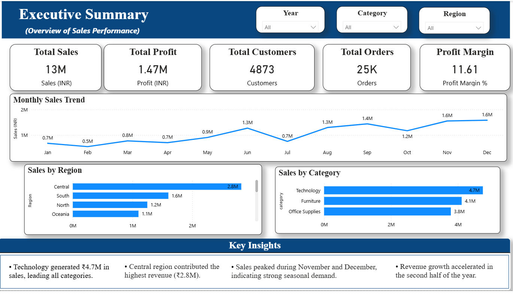
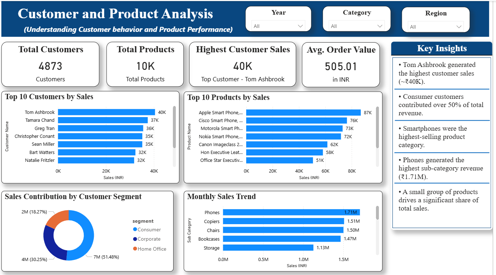
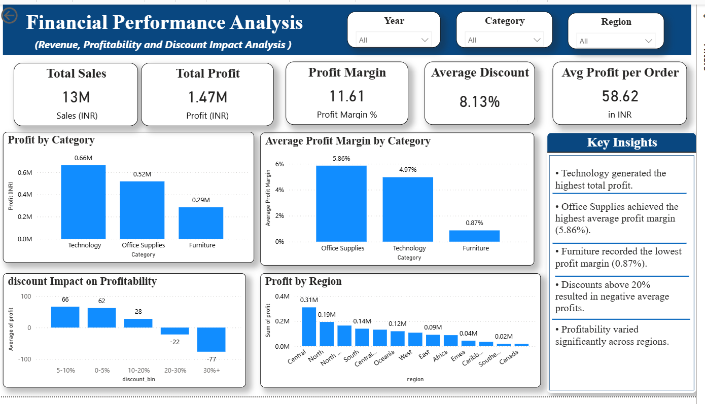

# E-Commerce Sales Analytics Dashboard

## Project Overview

This project analyzes a global E-Commerce sales dataset to uncover insights related to sales performance, profitability, customer behavior, product performance, and regional trends.

The objective is to transform raw business data into actionable insights using SQL, Python, and Power BI.

---

## Tools & Technologies

* SQL
* Python
* Pandas
* NumPy
* Matplotlib
* Seaborn
* Power BI
* GitHub

---

## Business Questions

This project answers the following business questions:

* Which product categories generate the highest sales?
* Which categories generate the highest profit?
* Who are the top customers?
* Which products contribute the most revenue?
* Which regions drive the highest sales and profit?
* How do discounts impact profitability?
* What opportunities exist to improve business performance?

---

## Project Workflow

### 1. Data Preparation

* Imported and cleaned the dataset.
* Handled missing values and data quality issues.
* Created derived columns such as:

  * Profit Margin
  * Sales per Unit
  * Discount Bins
  * Order Year
  * Order Month
  * Order Quarter

### 2. SQL Analysis

Performed business analysis using SQL queries:

* Sales by Category
* Profit by Category
* Sales by Region
* Profit by Region
* Top Customers
* Top Products
* Customer Segment Analysis
* Monthly Sales Trends
* Discount Impact Analysis

### 3. Python Exploratory Data Analysis (EDA)

Performed exploratory analysis using Python:

* Sales by Category
* Profit by Category
* Monthly Sales Trend
* Top Customers by Sales
* Top Products by Sales
* Sales by Region
* Profit Margin Analysis
* Discount Impact on Profitability

### 4. Power BI Dashboard

Built an interactive three-page dashboard:

#### Executive Summary

Provides a high-level overview of:

* Total Sales
* Total Profit
* Total Customers
* Total Orders
* Sales Trends
* Regional Performance

#### Customer & Product Analysis

Focuses on:

* Top Customers
* Top Products
* Customer Segments
* Product Performance
* Revenue Contribution

#### Financial Performance Analysis

Analyzes:

* Profitability
* Profit Margins
* Discount Impact
* Regional Profitability
* Financial KPIs

---

## Key Insights

### Sales Performance

* Technology generated the highest sales revenue.
* Sales peaked during November and December, indicating strong seasonal demand.

### Customer Analysis

* Consumer customers contributed over 50% of total sales.
* A small group of customers generated a significant share of revenue.

### Product Performance

* Phones were the highest-performing sub-category.
* Smartphones and office equipment dominated product sales.

### Profitability

* Technology generated the highest total profit.
* Office Supplies achieved the strongest average profit margin.
* Furniture recorded the lowest profit margin.

### Discount Analysis

* Profitability decreased as discount levels increased.
* Discounts above 20% consistently resulted in negative average profits.

---

## Dashboard Screenshots

### Executive Summary

### Customer & Product Analysis

### Financial Performance Analysis

---

## Repository Structure

E-Commerce-Sales-Analytics-Dashboard

├── Dataset

├── SQL

├── Python

├── Dashboard

└── README.md

---

## Author

**Himanshi Jain**

Aspiring Data Analyst | MSc Biotechnology | Learning Data Analytics, SQL, Python, Power BI, and Business Intelligence.

